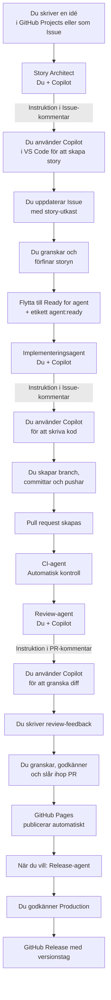

# Agentflöde för Blush & Bluff

## Översikt



## Systemarkitektur

| System eller agent | Roll | Vad den gör |
| --- | --- | --- |
| GitHub Actions | Automation | Förbereder instruktioner, kör CI-tester, hanterar branching och PR-skapande |
| GitHub Copilot (VS Code) | AI-assistent | Hjälper dig skapa stories, implementera kod och granska ändringar |
| Du | Ledare | Tar beslut, granskar resultat, godkänner ändringar och releaser |

## Arbetsgång – Steg för steg

### 1️⃣ Story Architect – Automatisk story-generering

1. **Skapa en Issue** med en kort idé (one-liner)
   ```
   Titel: "Lägg till mörkläge"
   Beskrivning: "Användare bör kunna växla mellan ljust och mörkt tema"
   ```

2. **Lägg etikett `story:expand`** → Story Architect kör automatiskt och:
   - Genererar en komplett story-struktur
   - Uppdaterar Issue-body med: Mål, Bakgrund, Omfattning, Acceptanskriterier, Testplan, Risker, Öppna frågor
   - Lägger etikett `awaiting-story-review`

3. **Granska story-utkastet** i Issue-body
   - Läs igenom strukturen
   - Uppdatera delar som behöver justering (mål, kriterier, etc.)
   - Lägg frågor under "Öppna frågor"

4. **Lägg etikett `story`** när du är nöjd

### 2️⃣ Implementeringsagent – Implementera en godkänd story

1. **Lägg etikett `agent:ready`** på en godkänd story → Implementeringsagent:
   - Visar hela story-texten
   - Ger instruktioner för git branching och PR-skapande

2. **Implementera i VS Code** med Copilot
   - Du öppnar Copilot Chat och skriver en prompt baserad på story-texten
   - Eller låter AI-agenten guida dig

3. **Skapa branch och committa**:
   ```
   git switch -c implement/issue-123
   git add -A
   git commit -m "Implementera story #123"
   git push origin implement/issue-123
   ```

4. **GitHub skapar en PR automatiskt** (eller du skapar en manuell PR)
   - CI-tester körs
   - Review-agent skapar instruktion för granskning

### 3️⃣ Review-agent – Granska en pull request

1. **PR skapas** → Review-agent skapar instruktion som säger:
   - Granska koden med Copilot Chat
   - Leta efter buggar, security-risker, regressioner, saknade tester

2. **Du granskar koden** med Copilot eller manuellt
   - Kommentera på PR:n med feedback
   - Godkänn eller begär ändringar

3. **Du slår ihop PR:n** när:
   - CI-tester är gröna
   - Granskning är klar
   - Allt ser bra ut

### 4️⃣ Release – Skapa en produktionsrelease

1. **Gå till Actions → Release – Blush & Bluff**

2. **Kör workflowet** med önskat versionsnummer (t.ex. `1.2.0`)

3. **Godkänn i production-miljön** när den frågar

4. **GitHub Release skapas** med automatiska release notes

## Säkerhetsregler

- Lägg ALDRIG lösenord, API-nycklar eller personuppgifter i en Issue eller PR
- Lägg endast `agent:ready` på stories som du själv har granskat noga
- Du måste godkänna alla releaser – agenten kan aldrig release själv
- CI-tester måste passa innan du slår ihop PR:er
- GitHub Actions får ALDRIG ändra säkerhetskritiska filer (.github, secrets, Firebase-regler)

## Etiketter

| Etikett | Mening |
| --- | --- |
| `story:expand` | Starta Story Architect – skapa story från one-liner |
| `story` | Story är skriven och klar för implementering |
| `agent:ready` | Story är godkänd – starta implementeringsagent |
| `awaiting-story-draft` | Väntar på att du ska skapa story-utkastet |
| `awaiting-implementation` | Väntar på att du ska implementera |
| `needs-refinement` | Story behöver förtydligas innan implementation |
